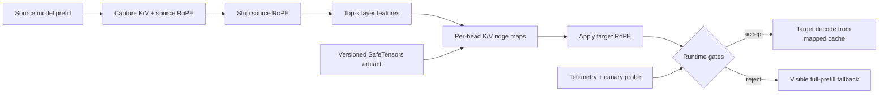

# KVBridge

[](https://github.com/souvikDevloper/kvbridge/actions/workflows/ci.yml)
[](https://www.python.org/)
[](LICENSE)

**Memory-bounded, failure-safe cross-model KV-cache transfer for LLM families.**

KVBridge is a production-oriented implementation and systems extension of NVIDIA's August 2026 paper, [Cross-Model KV Cache Transfer in LLM Families](https://arxiv.org/abs/2608.03893). It maps a source model's attention cache into a compatible target model so the target can continue without replaying the entire prompt.

The core algorithm is paper-faithful: target-layer-specific source selection, independent K/V ridge maps, cross-head features, and RoPE removal/reapplication. The systems work around it is original to this project: bounded-memory fitting, out-of-core SafeTensors shards, resource planning, revision/tokenizer gates, tamper-evident artifacts, guarded fallback, structured telemetry, a Hugging Face handoff adapter, and a reproducible CPU validation suite.

> **Evidence boundary:** the numerical core and failure paths are tested locally. The included Qwen3 plan reproduces the paper's mapper dimensions, but this machine has no CUDA device and did not run 14B/32B quality benchmarks. Full-model claims remain a partnership experiment, never a fabricated result.

## What ships

| Capability | Implementation |
|---|---|
| Paper mapper | Per-target-layer, per-target-head ridge maps for K and V |
| Layer selection | Head-averaged single-source R², then top-k cross-layer features |
| Position handling | Exact inverse/forward RoPE using factors emitted by each model |
| Modest-host fitting | Configurable target-layer blocks and re-iterable calibration factories |
| Distributed path | Mergeable sufficient statistics plus `torch.distributed` all-reduce |
| Data plane | SafeTensors calibration shards; no pickle deserialization |
| Artifact plane | Atomic writes, schema versioning, SHA-256 verification, model fingerprints |
| Runtime safety | Shape/architecture gates, finite/magnitude/latency gates, explicit fallback |
| Integration | Qwen/Llama-style Hugging Face `DynamicCache` handoff adapter |
| Operations | JSON resource planner, structured handoff events, CI, package build |
| Research | Local scale results, multi-lab protocol, DOCX/PDF follow-up paper |

## Thirty-second proof

```bash
python -m pip install -e .
kvbridge demo --output artifacts/demo
kvbridge inspect artifacts/demo
kvbridge plan configs/qwen3_14b_to_32b.paper.json
```

The demo downloads nothing. It creates two synthetic model-family members with different depths and RoPE bases, hides a known cross-layer affine map, fits only from cache pairs, and validates on an unseen sequence. The checked-in run recovered every true source layer and achieved holdout R² above `0.999998`.

## System design



Fitting is a two-stage, multi-pass process. The calibration input can be a Python sequence or a factory that reopens shards. Only sufficient statistics are retained:

\[
W=(X^T X + \lambda I)^{-1}X^T Y,\qquad b=\bar{Y}-\bar{X}W
\]

Target-layer blocking bounds peak memory. For Qwen3 14B→32B at `k=8`, the planner reports a 1,073,872,896-parameter (4.0005 GiB FP32) artifact and about 0.56 GiB of fit statistics per one-layer block. The cost is more sequential passes over calibration shards; this is intentional and configurable.

## Local evidence

The committed [local results](results/local_scale_results.json) were generated on an 8-thread CPU-only PyTorch 2.8 runtime. Each mapping measurement uses 10 warmups and 100 timed iterations.

| Case | Cache geometry | Holdout R² | Exact layer recovery | Median map latency |
|---|---:|---:|---:|---:|
| Micro | 3→2 layers, 2 heads × 4 dim, 64 tokens | 0.99999873 | Yes | 0.339 ms |
| Small | 5→4 layers, 2 heads × 8 dim, 128 tokens | 0.99999895 | Yes | 0.781 ms |
| Medium | 8→6 layers, 4 heads × 16 dim, 256 tokens | 0.99999892 | Yes | 2.844 ms |

These tests validate shape semantics, layer selection, ridge recovery, RoPE round trips, serialization, and scaling behavior. They do **not** estimate Qwen/Llama downstream accuracy or GPU speedup.

## Fitting from out-of-core shards

```python
from kvbridge.config import FitConfig, ModelSignature
from kvbridge.fit import fit_mapper
from kvbridge.io import calibration_shard_factory

source = ModelSignature(...)
target = ModelSignature(...)

mapper = fit_mapper(
    calibration_shard_factory("data/calibration"),
    source,
    target,
    FitConfig(
        top_k=8,
        ridge_alpha=0.01,
        accumulation_dtype="float32",
        selection_target_layer_block_size=8,
        target_layer_block_size=1,
    ),
)
mapper.save("artifacts/qwen3-14b-to-32b")
```

The factory is re-iterable because memory-bounded fitting makes several deterministic passes. Increase block sizes on high-memory nodes to reduce I/O.

## Live Hugging Face handoff

```python
from kvbridge.huggingface import greedy_handoff_generate
from kvbridge.mapper import CrossModelKVMapper

mapper = CrossModelKVMapper.load("artifacts/qwen3-14b-to-32b")
tokens = greedy_handoff_generate(
    source_model=source_model,
    target_model=target_model,
    mapper=mapper,
    input_ids=input_ids,
    max_new_tokens=64,
    eos_token_id=tokenizer.eos_token_id,
)
```

The adapter withholds the final prompt token, maps the preceding prefix cache, and lets the target consume that final token to produce its first logits. The adapter is deliberately marked experimental until each target Transformers release/model revision passes the integration matrix in [the experiment protocol](docs/EXPERIMENT_PROTOCOL.md).

## Failure is a first-class outcome

`GuardedTransferEngine` rejects non-finite or unbounded caches, enforces an optional latency budget, invokes an application quality probe, and emits a structured event on both acceptance and fallback. It never silently substitutes a failed bridge.

Production rollout should progress through:

1. Offline reconstruction and attention-output diagnostics.
2. Shadow traffic with full target prefill as the oracle.
3. Canary traffic with automatic quality and latency fallback.
4. Pair-specific benchmark gates and rollback thresholds.
5. Broader traffic only after revision-pinned evidence passes.

## Reproduction tiers

| Tier | Hardware | Purpose | Status |
|---|---|---|---|
| T0 | Any CPU | Unit, corruption, fallback, artifact, planner tests | Passing |
| T1 | Any CPU | Synthetic structural/scale sweep | Completed |
| T2 | 1 capable GPU | Tiny/small same-family end-to-end integration | Configured next step |
| T3 | Multi-GPU lab | Qwen3 14B→32B paper reproduction | Partnership-ready config |
| T4 | Multi-lab | Long-context, quantized, distribution-shift study | Proposed protocol |

See [architecture](docs/ARCHITECTURE.md), [experiment protocol](docs/EXPERIMENT_PROTOCOL.md), [threat model](docs/THREAT_MODEL.md), and [production checklist](docs/PRODUCTION_CHECKLIST.md).

## Development

```bash
python -m pip install -e ".[dev]"
ruff check src tests experiments
pytest
python experiments/run_local_scale.py --repeats 100 --warmup 10
python -m build
```

## Scope and limitations

- v0.1 deliberately gates on a shared tokenizer, matched KV heads/dimensions, and dense full attention: the regime validated by the NVIDIA paper.
- Reconstruction R² is a debugging metric, not a deployment acceptance metric. The paper finds attention-output cosine more predictive of downstream retention.
- A mapper is directional and model-revision-specific. Updating either checkpoint invalidates the artifact fingerprint and requires recalibration.
- Full Qwen/Llama evaluation requires gated model access and substantial accelerator memory. The repository contains the protocol and planner, not a false claim that those runs occurred here.
- No API stability is promised before v1.0.

## Attribution

KVBridge is an independent implementation and systems extension, not an NVIDIA product. Algorithmic credit belongs to Heo et al., [arXiv:2608.03893](https://arxiv.org/abs/2608.03893). Related approaches include [LatentAlign](https://arxiv.org/abs/2601.06123), [Cache-to-Cache](https://openreview.net/forum?id=LeatkxrBCi), [IAM](https://aclanthology.org/2025.acl-long.959/), and [DroidSpeak](https://arxiv.org/abs/2411.02820).

## License

Apache-2.0. See [LICENSE](LICENSE).
